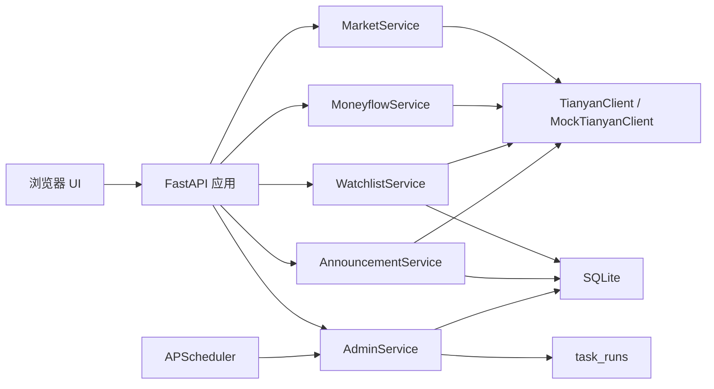

# 天策技术文档与操作指南

本文档面向后续开发、部署、排障和日常使用。当前版本对应 Phase 0 增强版：非测试模式默认通过天研拉取真实 A 股行情与公告，测试模式或显式配置可使用 mock 数据。

## 1. 系统概览

天策是一个本地股票观察工作台，核心目标是把自选股、K 线行情、公告、数据源状态和调度任务放在同一个轻量应用里。

当前技术栈：

- 后端：FastAPI
- 数据库：SQLite
- 调度：APScheduler
- 数据处理：pandas
- 前端：原生 HTML/CSS/JavaScript + ECharts CDN
- 测试：pytest + FastAPI TestClient

运行形态：

- 本地服务启动后监听 `127.0.0.1:8000`。
- API 与静态前端由同一个 FastAPI 应用提供。
- 非测试模式默认使用 `TianyanClient` 调用 `opencli tianyan sql`；测试模式默认使用 `MockTianyanClient`。
- 设置 `TIANCE_USE_MOCK_TIANYAN=1` 可在非测试模式强制使用 mock 数据。
- 非测试模式数据写入 `data/tiance.db`；测试模式数据写入 `work/tiance_test.db`。



## 2. 目录结构

```text
tiance/
  api/                 FastAPI 路由
  clients/             天眼客户端与 mock 客户端
  db/                  SQLite 连接与迁移
  scheduler/           调度任务注册与 task_runs 跟踪
  services/            业务服务层
  web/                 静态浏览器工作台
  config.py            本地配置
  errors.py            业务异常与统一响应
  main.py              应用工厂与生命周期
tests/                 后端与服务层测试
docs/                  设计、计划和本指南
data/                  本地运行数据库，已被 .gitignore 排除
work/                  测试数据库、日志、临时文件，已被 .gitignore 排除
```

## 3. 核心模块

### 3.1 应用入口

`tiance/main.py` 暴露 `create_app(testing: bool = False)`。

主要职责：

- 加载 `default_settings()`。
- 运行 SQLite 迁移。
- 创建天眼客户端与服务层实例。
- 注册 API 路由。
- 挂载 `tiance/web` 静态页面。
- 在非测试模式启动 APScheduler，并在应用关闭时停止调度器。

### 3.2 配置

`tiance/config.py` 的 `Settings` 包含：

- `root_dir`：项目根目录。
- `data_dir`：运行数据目录，测试模式为 `work/`，非测试模式为 `data/`。
- `db_path`：SQLite 文件路径。
- `use_mock_tianyan`：测试模式默认为 `True`；非测试模式默认为 `False`，可由 `TIANCE_USE_MOCK_TIANYAN` 覆盖。

### 3.3 数据库

迁移定义在 `tiance/db/migrations.py`。当前表包括：

- `groups`：自选分组。
- `watchlist`：自选股。
- `concepts` / `stock_concepts`：概念标签预留。
- `announcements`：公告、摘要与可用正文。
- `market_bars`：K 线本地备份。
- `money_flows`：主力资金流预留。
- `rank_list_events`：龙虎榜事件预留。
- `task_runs`：调度任务运行记录。

重要索引：

- `idx_announcements_secucode_publish`
- `idx_market_bars_secucode_trade`
- `idx_task_runs_task_started`

### 3.4 服务层

- `WatchlistService`：添加、查询、删除自选股。
- `MarketService`：从天研日线生成日/周/月 K 线，支持未复权与前复权，附带 MA、MACD、价格涨跌幅、成交量环比，并把日线备份到 `market_bars`。
- `MoneyflowService`：查询当前股票关联概念，过滤融资融券、地域、沪深股通等非业务概念，并聚合概念板块今日、5 日、20 日净资金流。当前版本实时查询天研，接口形状已为后续 SQLite 快照缓存预留。
- `AnnouncementService`：拉取自选股公告、分类、去重、列表查询、详情查询和本地摘要生成。
- `AdminService`：数据源状态、SQLite 表浏览、手动刷新、同名任务保护。

### 3.5 调度

`tiance/scheduler/runtime.py`：

- `run_tracked(db_path, task_name, work)` 会先写入 `running`，成功后写入 `success` 与 `rows_affected`，失败后写入 `failed` 与错误信息。
- `rows_affected=None` 会归一为 `0`；不可转换为整数的值会记录 `failed` 后抛出。
- `create_scheduler()` 使用 `Asia/Shanghai` 时区。

`tiance/scheduler/jobs.py` 注册：

- `fetch_announcements`：每小时第 5 分钟。
- `fetch_rank_list`：工作日 16:30。
- `fetch_money_flow`：工作日 16:30。

定时任务和手动刷新都通过 `AdminService.run_task()` 进入同名任务锁，避免同一任务并发重复执行。

## 4. API 说明

统一成功响应格式：

```json
{"data": "..."}
```

统一错误响应格式：

```json
{"error": {"code": "ERROR_CODE", "message": "错误信息"}}
```

### 4.1 健康检查

| 方法 | 路径 | 说明 |
| --- | --- | --- |
| GET | `/api/health` | 返回服务状态 |

### 4.2 自选股

| 方法 | 路径 | 说明 |
| --- | --- | --- |
| GET | `/api/watchlist` | 查询自选列表 |
| POST | `/api/watchlist` | 添加股票，body: `{"query": "600519"}` |
| GET | `/api/watchlist/{secucode}` | 查询单只股票 |
| DELETE | `/api/watchlist/{secucode}` | 删除股票 |

### 4.3 行情

| 方法 | 路径 | 说明 |
| --- | --- | --- |
| GET | `/api/market/{secucode}/kline` | 查询 K 线 |

常用 query 参数：

- `start`：开始日期，格式 `YYYY-MM-DD`，可选。
- `end`：结束日期，格式 `YYYY-MM-DD`，可选。
- `freq`：`D`、`W`、`M`，默认 `D`。
- `adjust`：复权模式，`none` 为未复权，`forward` 为前复权，默认 `none`。
- `ma`：均线周期，可重复传，也可逗号分隔，例如 `ma=5,10,20`。

返回点位包含：

- `pct_change`：相对上一根 K 线收盘价的涨跌幅百分比。
- `volume_change_pct`：相对上一根 K 线成交量的变化百分比。
- `adjust_ratio`：当前点位使用的价格复权比例，未复权为 `1`。

前复权使用 `wind_admin.ASHAREEODPRICES.S_DQ_ADJCLOSE_BACKWARD` 反推当日 OHLC 复权比例：

```text
adjust_ratio = S_DQ_ADJCLOSE_BACKWARD / S_DQ_CLOSE
```

示例：

```powershell
Invoke-RestMethod "http://127.0.0.1:8000/api/market/600519.SH/kline?start=2026-01-01&end=2026-06-14&freq=D&ma=5,10,20"
Invoke-RestMethod "http://127.0.0.1:8000/api/market/300502.SZ/kline?start=2026-06-09&end=2026-06-12&freq=D&adjust=forward&ma=5"
```

### 4.4 公告

| 方法 | 路径 | 说明 |
| --- | --- | --- |
| GET | `/api/announcements/{secucode}` | 查询公告，默认近 30 天 |
| GET | `/api/announcements/{secucode}/{ann_id}` | 查询公告详情 |
| POST | `/api/announcements/{secucode}/refresh` | 手动同步单只股票公告 |

参数：

- `bucket`：可选，按分类过滤，例如 `business`、`capital_flow`、`other`。
- `days`：查询时间范围，默认 `30`，最大 `365`。
- `limit`：默认 `50`，范围 `1..200`。

### 4.5 概念资金流

| 方法 | 路径 | 说明 |
| --- | --- | --- |
| GET | `/api/moneyflow/{secucode}/concepts` | 查询当前股票相关概念板块资金流 |

参数：

- `sort_window`：排序窗口，支持 `1`、`5`、`20`，默认 `20`。
- `limit`：返回概念数量，默认 `12`，范围 `1..30`。

返回字段：

- `latest_trade_date`：资金流数据最新交易日。
- `items[].concept_name`：概念名称。
- `items[].class_name` / `items[].subclass_name`：概念分类。
- `items[].flow_1d` / `flow_5d` / `flow_20d`：净主动流入金额，单位为万元。
- `items[].stock_count`：该概念下有资金流记录的成分股数量。

当前实现：

- 概念归属来自 `jydb.lc_coconcept` 与 `jydb.lc_conceptlist`。
- 资金流来自 `wind_admin.ASHAREMONEYFLOW.S_MFD_INFLOW`。
- 后端实时查询天研；后续需要优化查询性能与历史回看时，可增加 `concept_moneyflow_snapshots` 本地表，再让服务层优先读快照、缺失时回源天研。

### 4.6 管理端

| 方法 | 路径 | 说明 |
| --- | --- | --- |
| GET | `/api/admin/data-sources` | 查询数据源状态 |
| GET | `/api/admin/db/tables` | 查询 SQLite 表名 |
| GET | `/api/admin/db/tables/{table_name}/rows` | 浏览表数据 |
| POST | `/api/admin/refresh/{task_name}` | 手动触发刷新 |

当前数据源任务：

- `fetch_announcements`
- `fetch_rank_list`
- `fetch_money_flow`
- `reload_securities`

## 5. 前端工作台

静态文件位于 `tiance/web/`：

- `index.html`
- `styles.css`
- `app.js`

页面布局：

- 左侧：品牌、添加股票、自选列表和删除按钮。
- 中间：K 线图、成交量图、前复权切换、周期切换和相关概念资金流。
- 右侧：公告时间标签、摘要、详情与数据源状态切换。

操作入口：

1. 启动后打开 `http://127.0.0.1:8000`。
2. 输入 `600519` 或 `贵州茅台`。
3. 点击股票行。
4. 中间显示 K 线图、成交量图和相关概念资金流；点击“前复权”可切换复权绘图。
5. 点击公告可查看摘要、可用正文和原始链接。
6. 点击“同步公告”可同步当前股票公告；点击“数据源”查看管理端数据源状态。

前端使用 ECharts CDN。如果机器无法访问 CDN，页面主体可打开，但 K 线图不会渲染；后续可改为本地 vendored ECharts。

## 6. 本地开发与运行

### 6.1 安装依赖

```powershell
pip install -r requirements.txt
```

### 6.2 运行测试

```powershell
pytest -q
```

### 6.3 启动服务

方式一：

```powershell
.\run_tiance.ps1
```

方式二：

```powershell
python -m uvicorn tiance.main:create_app --factory --host 127.0.0.1 --port 8000
```

### 6.4 健康检查

```powershell
Invoke-RestMethod http://127.0.0.1:8000/api/health
```

期望结果：

```powershell
data
----
@{status=ok}
```

### 6.5 更换端口

如果 `8000` 被占用：

```powershell
python -m uvicorn tiance.main:create_app --factory --host 127.0.0.1 --port 8010
```

然后访问 `http://127.0.0.1:8010`。

## 7. 常用操作

### 7.1 添加股票

浏览器中输入：

```text
600519
```

或：

```text
贵州茅台
```

### 7.2 触发公告刷新

```powershell
Invoke-RestMethod -Method Post http://127.0.0.1:8000/api/admin/refresh/fetch_announcements
```

### 7.3 查看数据库表

```powershell
Invoke-RestMethod http://127.0.0.1:8000/api/admin/db/tables
```

查看某个表：

```powershell
Invoke-RestMethod "http://127.0.0.1:8000/api/admin/db/tables/watchlist/rows?limit=20&offset=0"
```

### 7.4 清空本地运行数据

停止服务后删除：

```powershell
Remove-Item data\tiance.db
```

下次启动时会自动重建表结构。

## 8. 测试策略

当前测试覆盖：

- SQLite 迁移与表结构。
- Mock 天眼数据。
- 自选股服务与 API。
- K 线、MA、MACD、日/周/月重采样。
- 公告分类、去重、列表、limit 边界。
- 管理端数据源、DB 浏览、手动刷新。
- `run_tracked` 成功、失败、异常 rows 归一化。
- 调度生命周期。
- 静态 UI 文件挂载。

推荐改动后至少运行：

```powershell
pytest -q
```

如果只改管理端或调度：

```powershell
pytest tests\test_admin.py tests\test_api.py -q
```

## 9. 排障指南

### 9.1 页面能打开但 K 线不显示

可能原因：

- ECharts CDN 无法访问。
- 浏览器控制台有 JavaScript 错误。
- `/api/market/{secucode}/kline` 返回错误。

检查：

```powershell
Invoke-RestMethod "http://127.0.0.1:8000/api/market/600519.SH/kline?freq=D&ma=5,10,20"
```

### 9.2 添加股票返回重复

`watchlist.secucode` 是主键。同一股票只能添加一次。需要重试时可以删除本地数据库或调用 DELETE 接口。

### 9.3 测试数据库被占用

Windows 上如果并行运行多个 `pytest`，可能同时占用 `work/tiance_test.db`。请串行运行测试，或先关闭残留 Python/Uvicorn 进程。

### 9.4 端口被占用

查看监听进程：

```powershell
Get-NetTCPConnection -LocalPort 8000 -State Listen
```

结束进程：

```powershell
Stop-Process -Id <PID> -Force
```

### 9.5 中文显示为乱码

PowerShell 可能按旧代码页显示 UTF-8 文件，终端看起来像 mojibake。以 Python UTF-8 读取为准：

```powershell
@'
from pathlib import Path
print(Path("README.md").read_text(encoding="utf-8")[:20])
'@ | python -
```

## 10. 版本维护

提交前建议：

```powershell
pytest -q
git status --short
git add .
git commit -m "Describe the change"
git push
```

当前仓库已排除：

- `data/`
- `work/`
- `outputs/`
- `__pycache__/`
- `.pytest_cache/`
- `*.db`
- `*.log`

## 11. 下一阶段建议

1. 接入真实天眼数据源，替换或扩展 `create_tianyan_client()`。
2. 为公告、龙虎榜、资金流补真实 SQL 映射与分页。
3. 将 ECharts 资源本地化，减少外部网络依赖。
4. 增加前端端到端测试。
5. 为手动刷新增加前端按钮与任务运行状态轮询。
